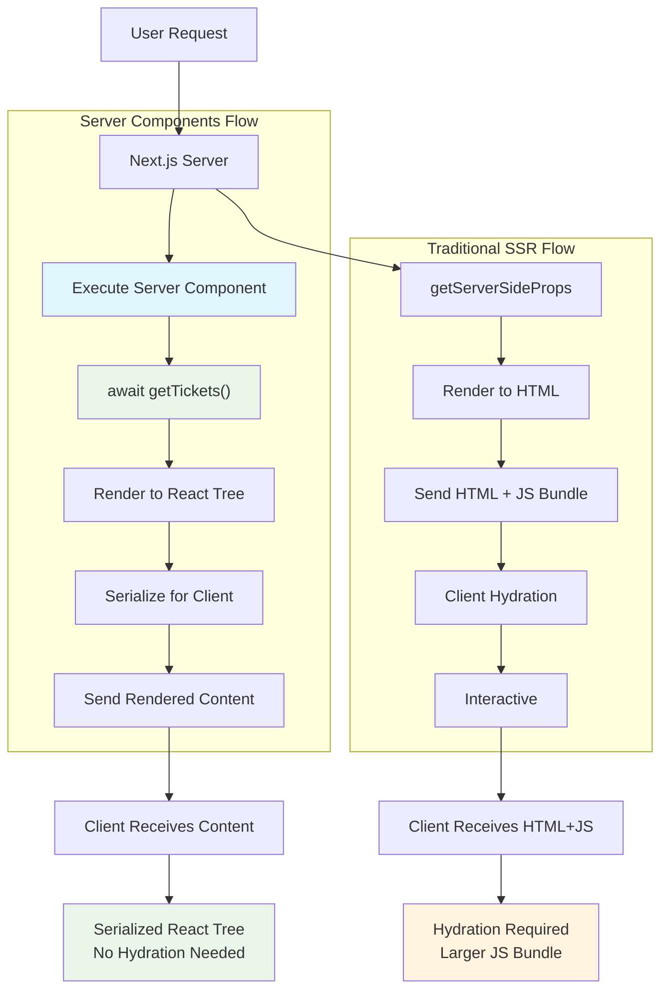

# SSR vs Server Components: A Complete Guide

This document explains the differences between traditional Server-Side Rendering (SSR) and Next.js Server Components, with practical examples from our ticket management app.

## Quick Overview

Both SSR and Server Components render content on the server, but they work very differently:

- **SSR**: Renders React components to HTML on the server, then sends HTML + JavaScript to client
- **Server Components**: Execute React components on the server and send a serialized React tree to client

## What are Server Components?

Server Components are React components that run exclusively on the server. They:

✅ **Reduce client-side JavaScript** - Send serialized React tree, not component code  
✅ **Access server-side resources** - Direct database/file system access  
✅ **Keep sensitive code secure** - API keys and logic stay on server  
✅ **Improve performance** - No hydration needed, faster initial loads

### What Server Components Actually Send

**Common misconception**: "Server Components send HTML"  
**Reality**: Server Components send a **serialized React tree** (not HTML, not raw React code)

Here's what actually happens:

1. **Server executes** the React component code
2. **Generates** a React element tree (virtual DOM)
3. **Serializes** that tree into a JSON-like format
4. **Sends** the serialized tree to the client
5. **Client receives** and renders the tree directly (no hydration needed)

**Example of what gets sent** (simplified):

```json
{
  "type": "section",
  "props": { "className": "flex-1 flex flex-col gap-y-8" },
  "children": [
    {
      "type": "Heading",
      "props": { "title": "Tickets Page", "description": "All your tickets..." }
    },
    {
      "type": "div",
      "children": [
        {
          "type": "ul",
          "props": { "className": "flex-1 flex flex-col..." },
          "children": [
            {
              "type": "TicketItem",
              "props": { "ticket": { "id": 1, "title": "Ticket 1" } }
            }
          ]
        }
      ]
    }
  ]
}
```

This is **not HTML** and **not JavaScript code** - it's a serialized representation of the React tree that the client can render directly.

## Key Differences: SSR vs Server Components

| Aspect               | Traditional SSR     | Server Components     |
| -------------------- | ------------------- | --------------------- |
| **When code runs**   | Server + Client     | Server only           |
| **JavaScript sent**  | Full component code | Serialized React tree |
| **Hydration**        | Required            | Not needed            |
| **Re-rendering**     | Client-side         | Server-side           |
| **State management** | Client-side hooks   | Server-side logic     |
| **Performance**      | Good                | Better                |

## Real Examples from Our Codebase

### Example 1: Our Tickets Page (Server Component)

Our current tickets page demonstrates a Server Component:

```typescript
// src/app/tickets/page.tsx - Current implementation
import Heading from "@/components/heading";
import TicketItem from "@/features/ticket/components/ticket-item";
import { getTickets } from "@/features/ticket/queries/get-tickets";

export default async function TicketsPage() {
  const tickets = await getTickets(); // Runs on server

  return (
    <section className="flex-1 flex flex-col gap-y-8">
      <Heading
        title="Tickets Page"
        description="All your tickets at one place."
      />

      <div>
        <ul className="flex-1 flex flex-col items-center gap-y-4 animate-fade-from-top">
          {tickets.map((ticket) => (
            <TicketItem key={ticket.id} ticket={ticket} />
          ))}
        </ul>
      </div>
    </section>
  );
}
```

**What makes this a Server Component:**

- ✅ No `"use client"` directive
- ✅ Async function that fetches data
- ✅ Data fetching happens on server
- ✅ No React hooks needed

### Example 2: Ticket Detail Page (Server Component)

Our ticket detail page shows server-side data access:

```typescript
// src/app/tickets/[ticketId]/page.tsx
import initialTickets from "@/tickets.data";

export default function TicketPage({ params }: TicketPageProps) {
  const ticketId = Number(params.ticketId);
  const ticket = initialTickets.find((ticket) => ticket.id === ticketId);

  if (!ticket) {
    return <Placeholder label="Ticket not found" />;
  }

  return (
    <div className="flex justify-center animate-fade-from-top">
      <TicketItem ticket={ticket} isDetail />
    </div>
  );
}
```

**Benefits in this example:**

- ✅ **No loading states** - Data available immediately
- ✅ **SEO-friendly** - Content in initial HTML
- ✅ **Error handling** - Server-side validation

## Traditional SSR vs Our Server Components

### How Traditional SSR Would Work:

```typescript
// Traditional SSR approach (NOT what we're using)
export async function getServerSideProps() {
  const tickets = await getTickets();

  return {
    props: {
      tickets, // Passed as props
    },
  };
}

export default function TicketsPage({ tickets }) {
  // Component runs on server AND client
  // Requires hydration
  return <TicketList tickets={tickets} />;
}
```

### Our Server Components Approach:

```typescript
// Our current approach - Server Components
export default async function TicketsPage() {
  const tickets = await getTickets(); // Direct data fetching

  // Component runs ONLY on server
  // No hydration needed
  return <TicketList tickets={tickets} />;
}
```

## When Server Components Execute

Understanding the execution flow helps clarify the differences:



### Server Component Flow:

1. **Request comes in** → Server receives page request
2. **Component executes** → `TicketsPage()` runs on server
3. **Data fetching** → `await getTickets()` executes
4. **Rendering** → Component renders to React element tree
5. **Serialization** → React tree serialized to JSON-like format
6. **Response sent** → Client receives serialized React tree

### Traditional SSR Flow:

1. **Request comes in** → Server receives page request
2. **Data fetching** → `getServerSideProps()` runs
3. **Component rendering** → Component renders to HTML
4. **HTML sent** → Client receives HTML + JavaScript
5. **Hydration** → Client re-renders component
6. **Interactive** → Page becomes interactive

## Practical Benefits in Our App

### 1. Simplified Data Fetching

**Before (if using traditional SSR):**

```typescript
// Complex setup required
export async function getServerSideProps() {
  const tickets = await getTickets();
  return { props: { tickets } };
}

export default function TicketsPage({ tickets }) {
  return <TicketList tickets={tickets} />;
}
```

**Now (Server Components):**

```typescript
// Simple and direct
export default async function TicketsPage() {
  const tickets = await getTickets();
  return <TicketList tickets={tickets} />;
}
```

### 2. Better Performance

Our `getTickets()` function has an artificial 2-second delay:

```typescript
// src/features/ticket/queries/get-tickets.ts
export const getTickets = async (): Promise<Ticket[]> => {
  await new Promise((resolve) => setTimeout(resolve, 2000)); // 2 second delay
  return new Promise((resolve) => {
    resolve(initialTickets);
  });
};
```

With Server Components:

- ✅ **2-second delay happens on server** (user doesn't see loading spinner)
- ✅ **Content arrives pre-rendered** (instant display)
- ✅ **No hydration delay** (immediately interactive where needed)

### 3. Type Safety

Our Server Components maintain full TypeScript support:

```typescript
// src/features/ticket/types.ts
export interface Ticket {
  id: number;
  title: string;
  content: string;
  status: TicketStatus;
}

// Type-safe in Server Components
export default async function TicketsPage() {
  const tickets: Ticket[] = await getTickets(); // Fully typed
  return <TicketList tickets={tickets} />;
}
```

## When to Use Each Approach

### Use Server Components When:

- ✅ **Initial page data** - Like our tickets listing
- ✅ **SEO-critical content** - Product pages, blog posts
- ✅ **Static or slow-changing data** - Like our ticket data
- ✅ **Sensitive operations** - Database queries, API calls

### Use Client Components When:

- ✅ **User interactions** - Forms, buttons, state changes
- ✅ **Real-time updates** - Live notifications, chat
- ✅ **Browser APIs** - localStorage, geolocation
- ✅ **Interactive widgets** - Dropdowns, modals

### Our Mixed Approach:

```typescript
// Server Component for data
export default async function TicketsPage() {
  const tickets = await getTickets();

  return (
    <div>
      <TicketList tickets={tickets} /> {/* Server Component */}
      <AddTicketForm /> {/* Client Component for interaction */}
    </div>
  );
}
```

## Common Misconceptions

### ❌ "Server Components are just SSR"

**Reality:** Server Components don't hydrate - they stay on the server

### ❌ "You can't use interactivity with Server Components"

**Reality:** You can mix Server and Client Components in the same app

### ❌ "Server Components are slower"

**Reality:** They're often faster due to no hydration and less JavaScript

## Summary

**Server Components** (what we use) give us:

1. **Simpler code** - Direct data fetching, no complex patterns
2. **Better performance** - No hydration, less JavaScript
3. **Enhanced security** - Sensitive code stays on server
4. **Improved SEO** - Content available immediately

Our ticket management app demonstrates these benefits with clean, performant Server Components that deliver content fast while maintaining the ability to add interactivity where needed.
